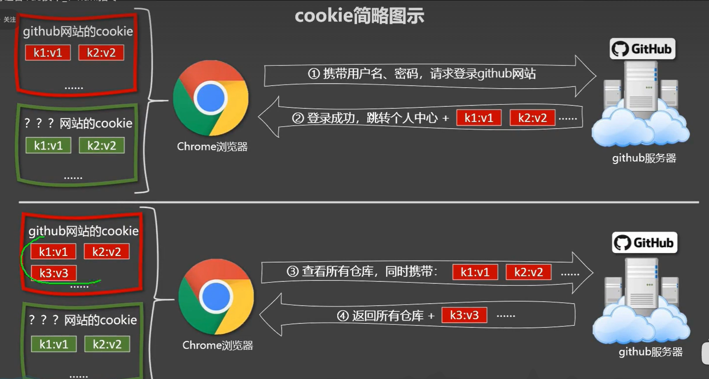
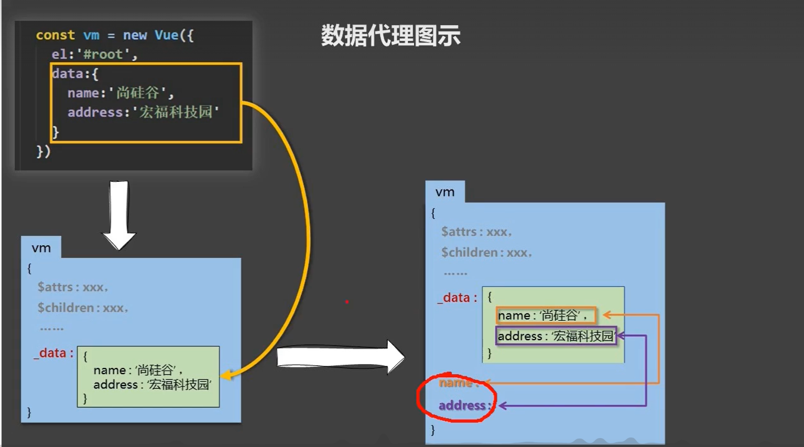
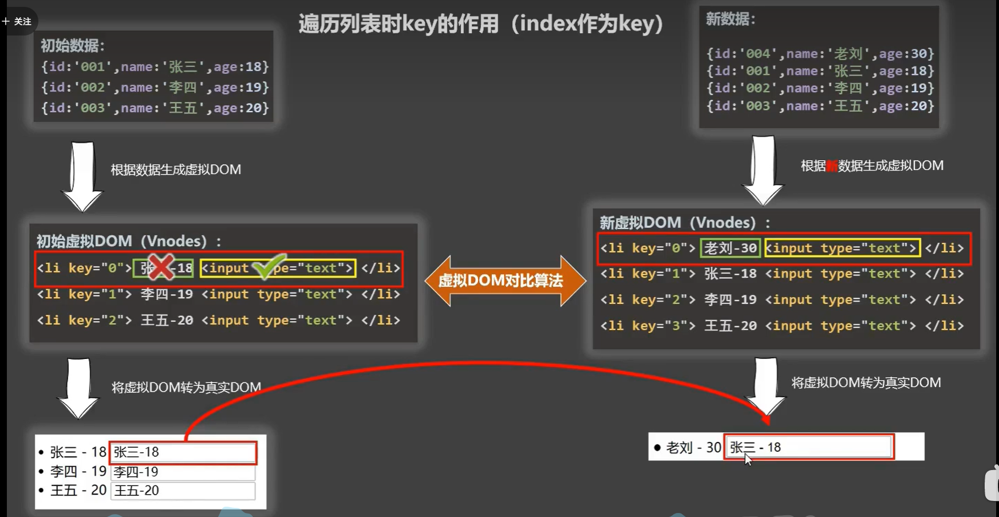

### cookie原理



<br/>

<br/>

### 数据代理





### 面试题：react、vue中的key有什么作用？（key的内部原理）

```
1. 虚拟DOM中key的作用：
  key是虚拟DOM对象的标识，当数据发生变化时，Vue会根据【新数据】生成【新的虚拟DOM】, 
  随后Vue进行【新虚拟DOM】与【旧虚拟DOM】的差异比较，比较规则如下：

2.对比规则：
  (1).旧虚拟DOM中找到了与新虚拟DOM相同的key：
    ①.若虚拟DOM中内容没变, 直接使用之前的真实DOM！
    ②.若虚拟DOM中内容变了, 则生成新的真实DOM，随后替换掉页面中之前的真实DOM。

(2).旧虚拟DOM中未找到与新虚拟DOM相同的key
  创建新的真实DOM，随后渲染到到页面。

3. 用index作为key可能会引发的问题：
  1. 若对数据进行：逆序添加、逆序删除等破坏顺序操作:
    会产生没有必要的真实DOM更新 ==> 界面效果没问题, 但效率低。
  
  2. 如果结构中还包含输入类的DOM：
    会产生错误DOM更新 ==> 界面有问题。

4. 开发中如何选择key?:
  1.最好使用每条数据的唯一标识作为key, 比如id、手机号、身份证号、学号等唯一值。
  2.如果不存在对数据的逆序添加、逆序删除等破坏顺序操作，仅用于渲染列表用于展示，
  使用index作为key是没有问题的。
```

### computed和watch之间的区别

```
  computed和watch之间的区别：
          1.computed能完成的功能，watch都可以完成。
          2.watch能完成的功能，computed不一定能完成，例如：watch可以进行异步操作。
  两个重要的小原则：
              1.所被Vue管理的函数，最好写成普通函数，这样this的指向才是vm 或 组件实例对象。
              2.所有不被Vue所管理的函数（定时器的回调函数、ajax的回调函数等、Promise的回调函数），最好写成箭头函数，
                  这样this的指向才是vm 或 组件实例对象。
```

### Vue监视数据的原理：

```
Vue监视数据的原理：
vue会监视data中所有层次的数据。如何监测对象中的数据？
 通过setter实现监视，且要在new Vue时就传入要监测的数据。
 (1).对象中后追加的属性，Vue默认不做响应式处理
 (2).如需给后添加的属性做响应式，请使用如下API：
     Vue.set(target，propertyName/index，value) 或 
     vm.$set(target，propertyName/index，value)如何监测数组中的数据？
 通过包裹数组更新元素的方法实现，本质就是做了两件事：
 (1).调用原生对应的方法对数组进行更新。
 (2).重新解析模板，进而更新页面。在Vue修改数组中的某个元素一定要用如下方法：
  1.使用这些API:push()、pop()、shift()、unshift()、splice()、sort()、reverse()
  2.Vue.set() 或 vm.$set()
    特别注意：Vue.set() 和 vm.$set() 不能给vm 或 vm的根数据对象 添加属性！！！ 

```
