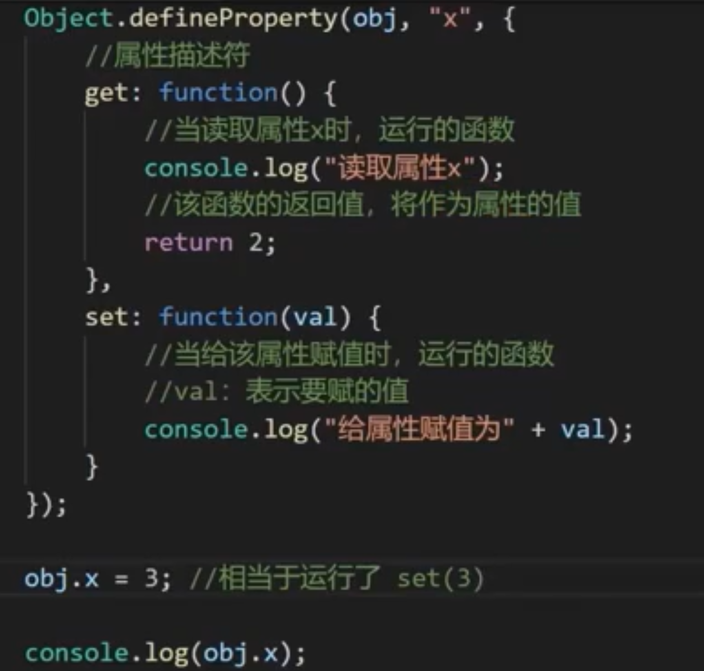
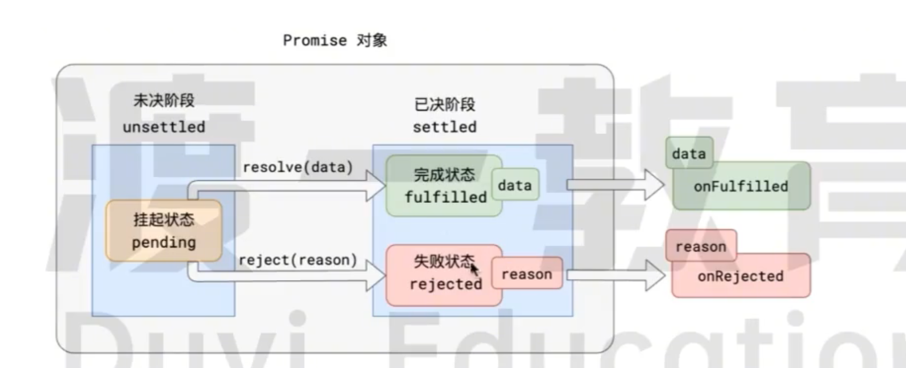
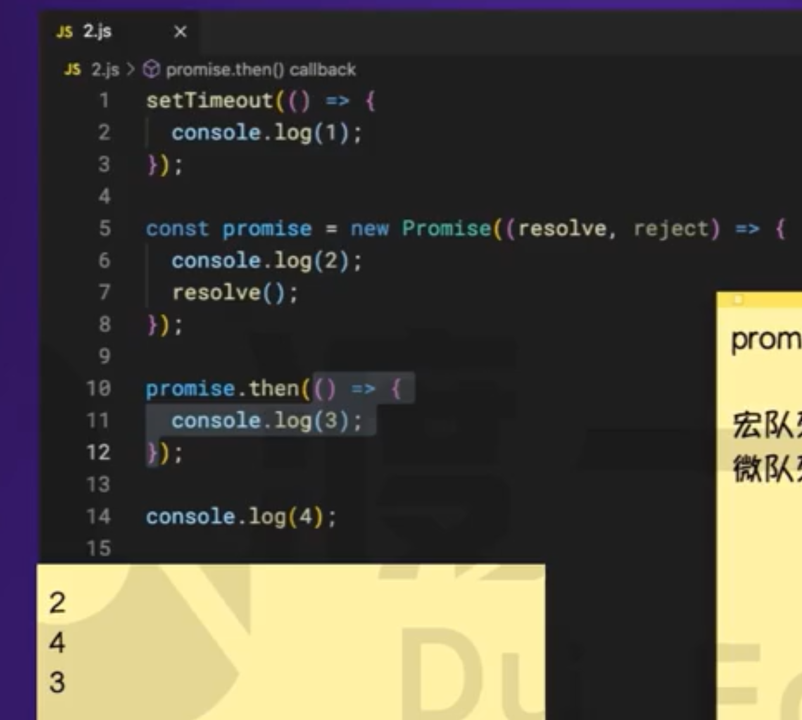
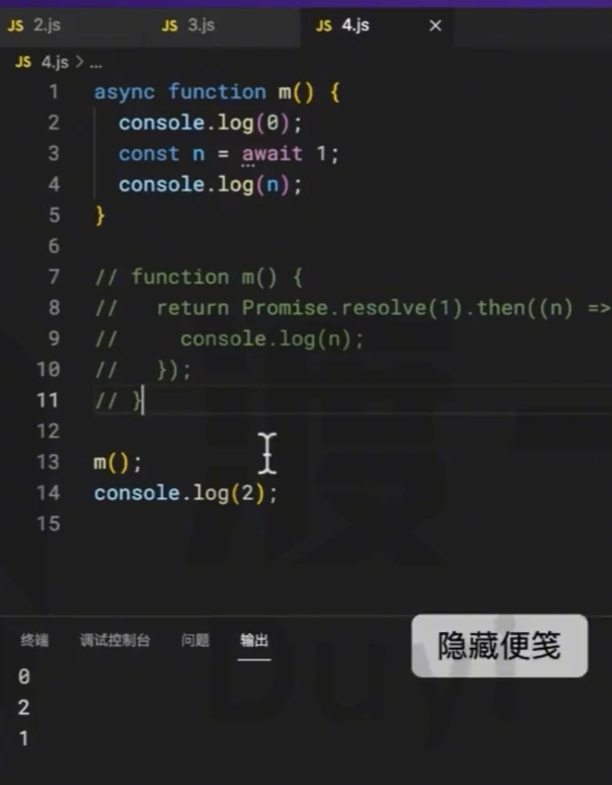

## 属性描述符

表示一个属性的相关信息（元数据），本质是对象。白话就是描述数据的数据

1. 数据属性
2. 存取器属性
   1. 读取运行getter
   2. 更改运行setter
   3. 
   4. 上图最后一个打印还是2，因为只是运行了函数get

## promise



### 链式调用（then）

1. 后续任务没有进行处理的话，新任务与前任务一致，数据状态都一致
2. 后续有处理的话，前任务挂起的话，后任务也挂起
3. 若后续执行了，后续处理的情况确定新任务的状态
   1. 后续处理执行无错，新任务为完成，且数据为后续处理的返回值
   2. 后续执行错误，新任务为错误，数据为异常对象
   3. 后续任务返回是的promise,这新任务的状态与后续任务的状态一致,并且返回的promise放入微队列

```js
// 1后续任务没有进行处理的话，新任务与前任务一致，数据状态都一致
const pr1 = new Promise((resolve, reject) => {
    // reject('err')
    resolve('success')
})
const pr2 = pr1.then().then().then(res => {
    console.log(res);
    return 1
}).then(res => {
    console.log(res);
})
```

```js
// 2后续有处理的话，前任务挂起的话，后任务也挂起
const pr1 = new Promise((resolve, reject) => {
    // reject('err')
    setTimeout(() => {
        resolve('success')
    }, 2000);
})
const pr2 = pr1.then(res => {
    console.log('学习', res);
})
setTimeout(() => {
    console.log(pr2);
}, 1000);
```

```js
// 3若后续执行了，后续处理的情况确定新任务的状态
// 3.1 后续处理执行无错，新任务为完成，且数据为后续处理的返回值

const pr1 = new Promise((resolve, reject) => {
    resolve()
})
// 后续处理
const pr2 = pr1.then(() => {
    console.log('学习');
    return 123
})
// 新任务
pr2.then(res => {
    console.log('res:', res);
})
```

```js
// 3.2 后续执行错误，新任务为错误，数据为异常对象
const pr1 = new Promise((resolve, reject) => {
    resolve()
})
// 后续处理
const pr2 = pr1.then(() => {
    console.log('学习');
    throw 'err'

})
// 新任务
const pr3 = pr2.then(res => {
    console.log('res:', res);
}).catch(err => {
    console.log('err:',err)
})
setTimeout(() => {
    console.log(pr3);
}, 1000)

```

```js
// 3.3 后续任务返回是的promise,这新任务的状态与后续任务的状态一致
// 并且返回的promise放入微队列
const pr1 = new Promise((resolve, reject) => {
    resolve()
})
// 后续处理
const pr2 = pr1.then(() => {
    console.log('学习');
    // 后续返回 
    return new Promise((resolve, reject) => {
        setTimeout(() => reject('新promise'), 1000)
    })

})
pr2.catch(err => {})
// 新任务
setTimeout(() => {
    console.log('pr2', pr2);
}, 2000);
```

### promise面试题



链式调用


语法糖

其实就是await后面的语句放入微队列里面，相对于then语句



金典1

```js
async function m1(){
    return 1;
}

async function m2(){
    const n  = await m1();
    console.log(n);
    return 2;
}

async function m3(){
    const n =  m2();
    console.log(n);
    return 3;
}
m3().then((n)=>{
	console.log(n);
})

m3()
console.log(4);
```

