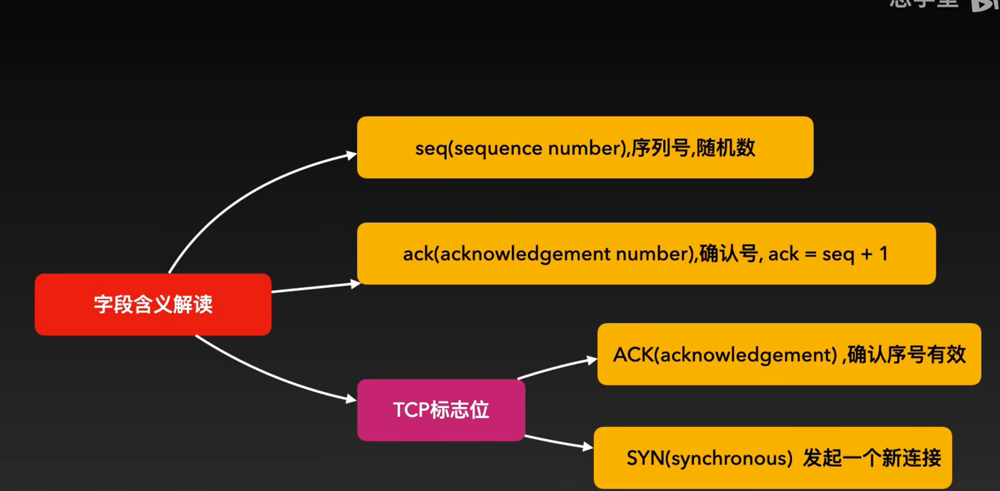
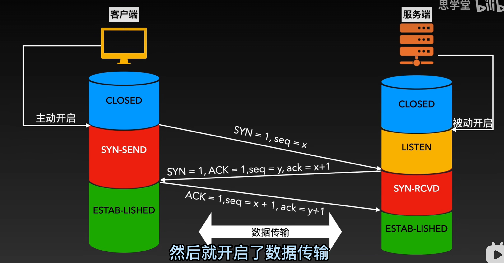
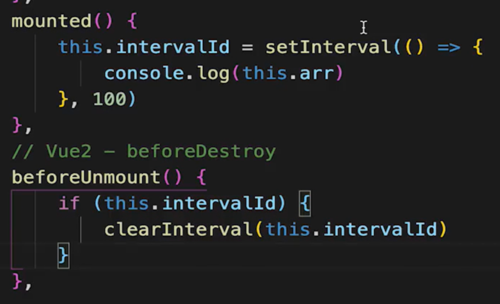
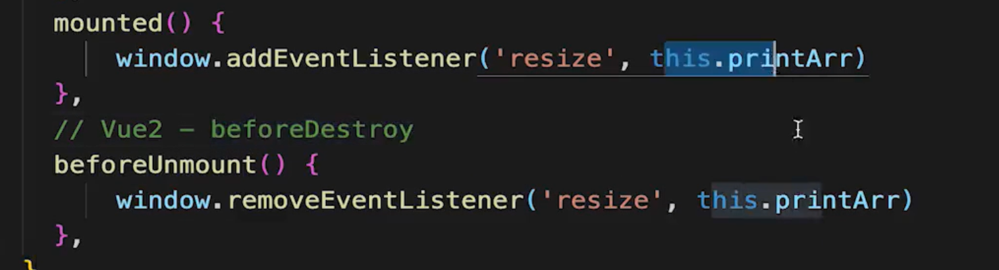
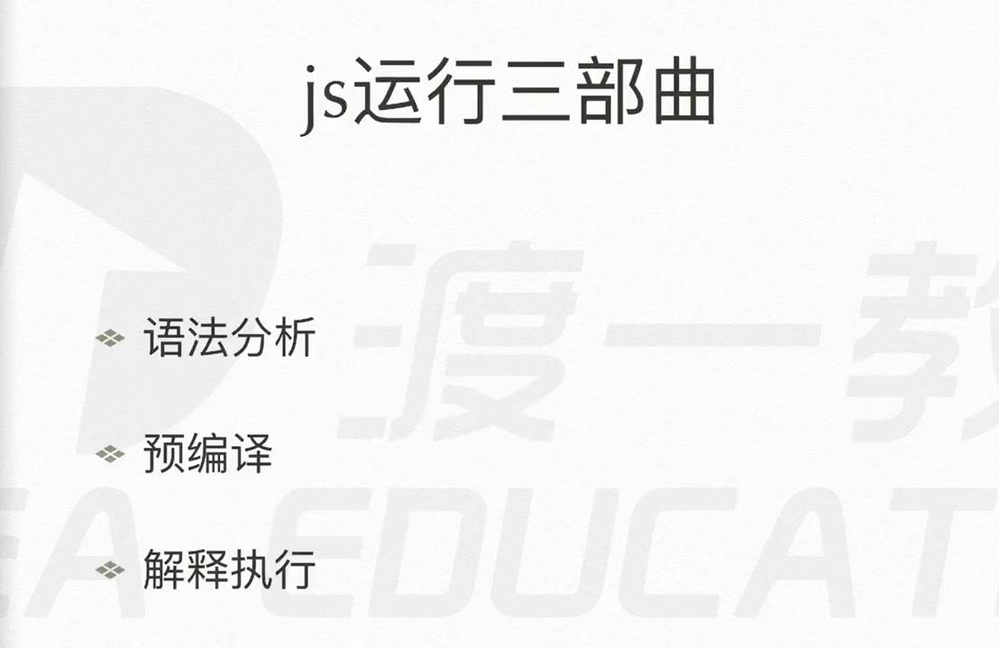
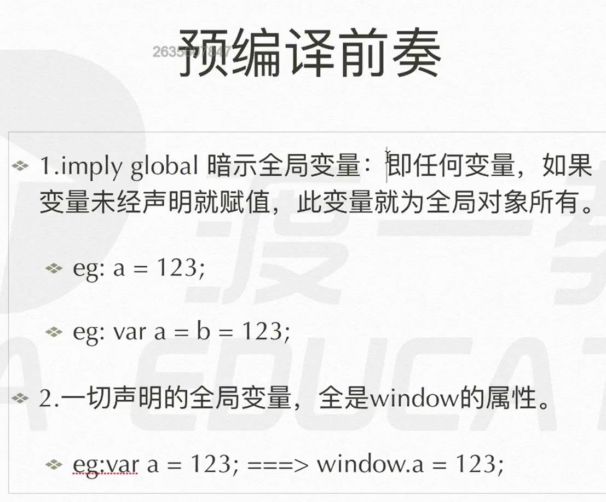
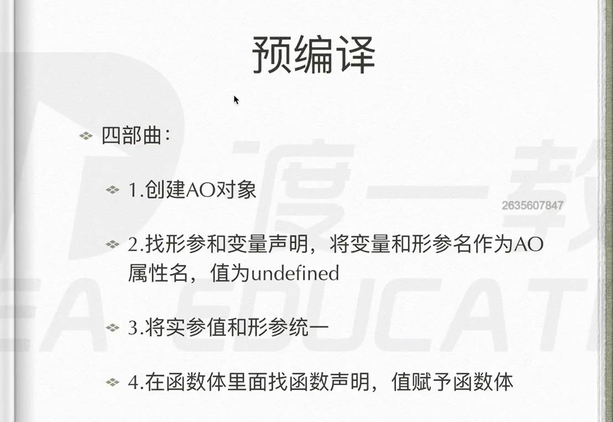
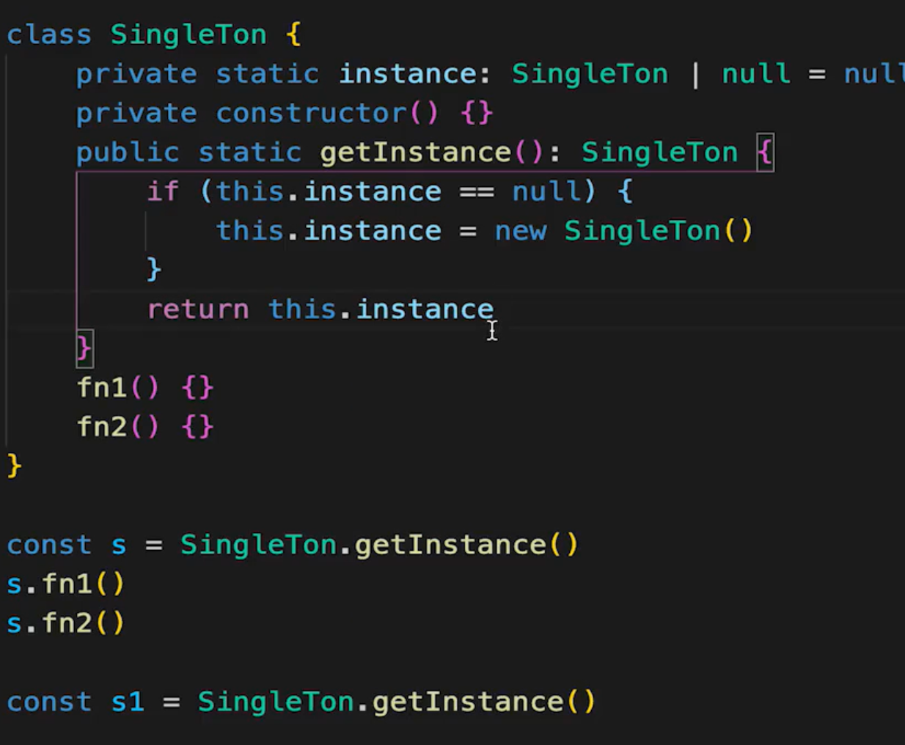
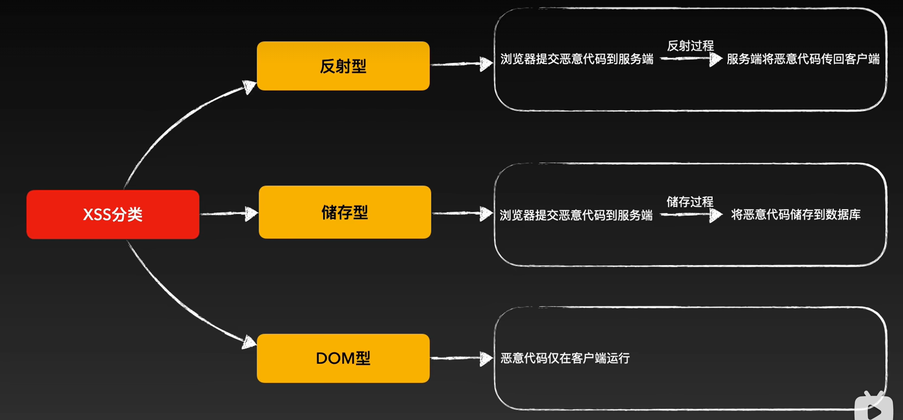
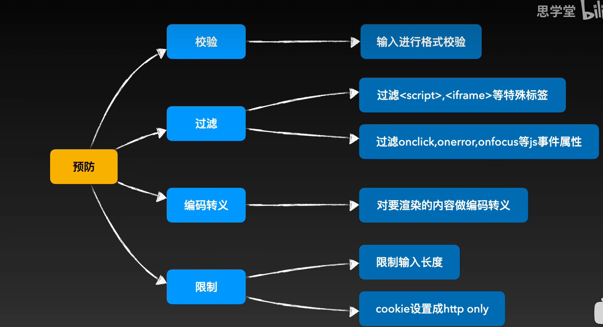

## TCP连接

三次握手：

1. 你好了吗
2. 我好了
3. 那我要发消息了





1. 客户端向服务端发送报文：建立连接；自己的随机序列号
2. 服务端回客户端：同意建立建立；确认序列号；发送自己的随机序列号
3. 客户端回复：确认收到序列号；携带自己的序列号+1
4. 建立已连接阶段

四次挥手：

1. 我发完了
2. 收到
3. 我也发完了（服务器）
4. 行，断开吧

## 垃圾回收

### 引用计数（之前）：

查看引用数量是否被引用

```
Function fn1(){
	const a = {} //回收
	const b = {}
}
fn1()  
```

弊端：

```
// 循环引用
Function fn2(){
	const a = {}
	const b = {}
	a.aaa = b
	b.bbb = a
}
fn2()
```

### 标记清除（现代）：

循环判断全局window的属性，不能被得到则删除。

### vue中内存泄漏情况

1. 全局设置变量或函数

   

2. 组件中使用定时器

   



## token与cookie

### cookie:

1. 默认请求就每次请求携带cookie，帮助识别身份
2. 用户登录后，后端验证成功把用户信息存储在session中，后在客户端设置cookie，一般是用户ID
3. 服务端可在客户端设置cookie，默认大小4KB
4. 默认有跨域限制：不可跨域共享，传递cookie

### token:

1. 前端发起登录，后端验证成功后返回加密后的token，
2. 后续请求token需要设置在请求头里面
3. 前端客户端自行存储

### 二者区别：

- cookie:HTTP标准，跨域限制，配合session使用
- token:无标准，无跨域，用于JWT

### session与JWT优缺点：

- session:
  - 优点：
    - 存储在客户端，可快速封禁违规用户
  - 缺点：
    - 存储在内存中，占用内存，成本高
    - 多进程多服务，不好同步，因为内存有间隔
    - 默认有跨域
- JWT：
  - 优点：
    - 不占用内存
    - 多进程多服务不影响
  - 缺点：
    - 不能快速封禁用户，需要设置黑名单
    - 服务端秘钥泄漏会被解密
    - token体积大一点点

- 选择：
  - 严格管理用户信息，保密封禁等选择session
  - 否则选择JWT

## 预编译







## 响应状态码

1开头：需要客户端继续操作

2开头：操作成功并处理

- 200：OK请求成功

3开头：重定向

- 301：Moved Permanently永久重定向
- 302：临时重定向
- 303：Not Modified为被修改

4开头：客户端错误

- 400： Bad Request 语义有误
- 403：Forbidden 没有权限，拒绝执行
- 404：资源不存在

5开头：服务端错误

- 500：服务器内部错误

## 前端常用设计模式

工厂模式：隐藏new，如jQuery的$，创建多种实例

单例模式：全局唯一存在一个实例，如Vuex的Store，全局唯一的dialog model



代理模式：使用者不能访问直接对象，而是访问一个代理，如es6的Proxy实现的vue3响应式

观察者模式：一个主题一个观察者，主题变化之后触发观察者执行。如监听事件

发布订阅模式：绑定事件

装饰器模式：原功能不变，增加一些新功能，如es6的Decorator,next.js

观察者模式和发布订阅模式区别

- 观察者模式和发布订阅模式最大的区别就是发布订阅模式有个事件调度中心。
- 
- 从图中可以看出，观察者模式中观察者和目标直接进行交互，而发布订阅模式中统一由调度中心进行处理，订阅者和发布者互不干扰。这样一方面实现了解耦，还有就是可以实现更细粒度的一些控制。比如发布者发布了很多消息，但是不想所有的订阅者都接收到，就可以在调度中心做一些处理，类似于权限控制之类的。还可以做一些节流操作。

## 浏览器缓存

发展历程：

1. 采用expires过期时间

   问题？服务端和客户端时间不统一

2. 换过期时间

   ```
   Cache-Control:max-age=3600(秒)
   ```

   no-cache：不使用强缓存
   no-store：禁止缓存
   private：只有浏览器可以缓存
   public:浏览器，服务器，代理服务器都可以缓存

   问题？每次结束后又会大量请求

3. 使用强缓存和协商缓存

   - 强缓存：在缓存没有过期的时间浏览器直接决定使用缓存
   - 协商缓存：过期后，询问服务器是否可使用缓存。等浏览器返回
     - 具体操作：
       1. 响应头加上Last-Modified，问题？因为是以秒记时。一秒内更新会出现问题
       2. 后采用标识特定资源的版本Etag(就是个字符串)

## DNS解析流程

1. 浏览器DNS缓存
2. 本地DNS缓存
3. 本地HOST文件
4. 本地DNS服务器缓存
5. 根服务器
6. 顶级域名服务器
7. 权威域名服务器

## xxs

侧重于脚本，千方百计注入并执行

**危害**：

- 窃取cookie
- 劫持流量
- 插入广告
- 置入木马
- 获取用户信息

**主要途径**：

- url参数注入
- 输入框注入

**分类**：

- 反射性：一般通过url输入，提交恶意代码向服务端，服务端再讲恶意代码传回客户端
- 储存型：讲恶意代码提交到服务器，存储在数据库中
- DOM型：仅仅在客户端运行



**解决方案**：

- 防止注入与防止执行

- **对输入进行过滤，对输出进行转义**

  

## 在浏览器地址栏输入地址，并按下回车键后，发生了哪些事情?


1. 浏览器自动补全协议、端口
2. 浏览器自动完成ur1编码
3. DNS解析
   1. 浏览器DNS缓存
   2. 本地DNS缓存
   3. 本地HOST文件
   4. 本地DNS服务器缓存
   5. 根服务器
   6. 顶级域名服务器
   7. 权威域名服务器
4. 拿到域名后，浏览器向服务器发出建立TCP连接的申请，完成三次握手后，连接通道建立
5. 若使用了HTTPS协议，则还会进行SSL握手，建立加密信道。使用SSL握手时，会确定是否使用HTTP2
6. 浏览器决定要附带哪些cook1e到请求头中
7. 浏览器自动设置好请求头、协议版本、cook1e,发出GET请求
8. 服务器处理请求，进入后端处理流程。完成处理后，服务器响应一个HTTP报文给浏览器。
9. 浏览器根据使用的协议版本，以及Connection字段的约定，决定是否要保留TCP连接
10. 浏览器根据响应状态码决定如何处理这一次响应
11. 浏览器根据响应头中的Content-Type字段识别响应类型，如果是text/html,则对响应体的内容进行HTML解析，否则做其他处理
12. 浏览器根据响应头的其他内容完成缓存、cook1e的设置
13. 浏览器开始从上到下解析HTML,遇到外部资源链接，则进一步请求资源
14. 解析过程中生成DOM树、CSSOM树，然后一边生成，一边把二者合并为渲染树(renderingtree）,随后对渲染树中的每个节点计算位置和大小（reflow),最后把每个节点利用GPU绘制到屏幕（repaint】
15. 在解析过程中还会触发一系列的事件，当D0M树完成后会触发DOMContentLoaded.事件，当所有资源加载完毕后会触发load事件。